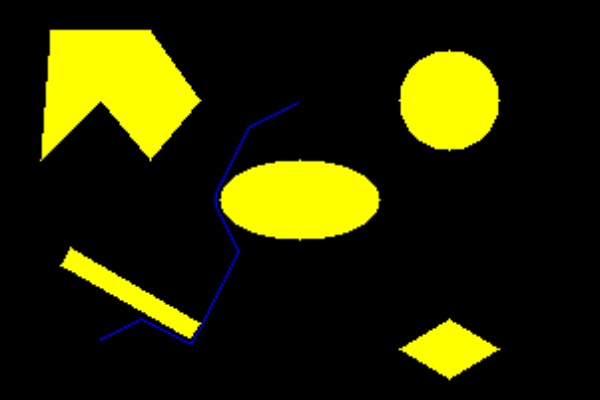
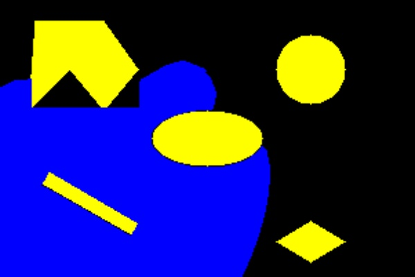
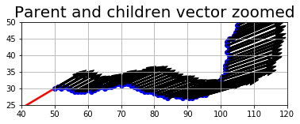
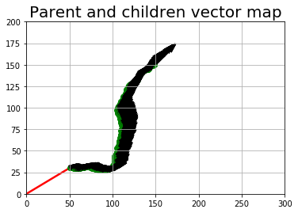

Authors
--

	Govind Ajith Kumar
	UID : 116699488
	Masters Robotics 
	University of Maryland
	College Park
	Maryland
	20740 USA

	Rajeshwar NS
	UID : 116921237
	Masters Robotics
	University of Maryland
	College Park
	Maryland
	20740 USA

Youtube
--
	https://www.youtube.com/watch?v=VBzvzb2vaYg&feature=emb_log
	https://www.youtube.com/watch?v=_RSq41MF34w
	https://youtu.be/YeQo8LIU1ZE
Note:
--
	Also attached a new folder, with an alternative method, where we found a much faster solution.### 

 
 
 
 
 
 
 
 
 
 

Language
--
	Python 3.7.x

Libraries
--

	numpy :: for matrices and other associated numerical calculations. 
	math :: for all mathematical operations
	heapq :: for priority queue
	time :: for measuring the time
	cv2 :: for image related operations (OpenCV 4.xx)
	pygame :: For animations
	matplotlib:: To plot the graphs and see the path taken by the robot from the start to the goal node

This README file is for two codes
The programme solves the obstacle map based on the Dijkstras Algorithm. 

Code
--
This code solves the obstacle map based on the A* Algorithm For Rigid Robot with a radius and clearance
The following inputs are required by the user:

	x_start= the x coordinate of the start
	y_start= y coordinate of the start
	orientation = starting orientation of the Robot
	x_goal= x coordinate of the goal
	y_goal= y coordinate of the goal
	Radius = Radius of the robot
	Clearence = Clearance of the robot

Once the backtracking is complete the following sets of outputs are given out:

	Image of the obstacles (OpenCV)
	Animation showing the visited nodes and the backtracked path (using pygame)
	Graph plot showing path of solution (MatplotLib)
	Image of the visited nodes (OpenCV)
	Image of backtracked path (OpenCV)
	Graph plot showing children direction for each parent (MatplotLib)
	Zoomed in version of the quivers generated (MatplotLib)

